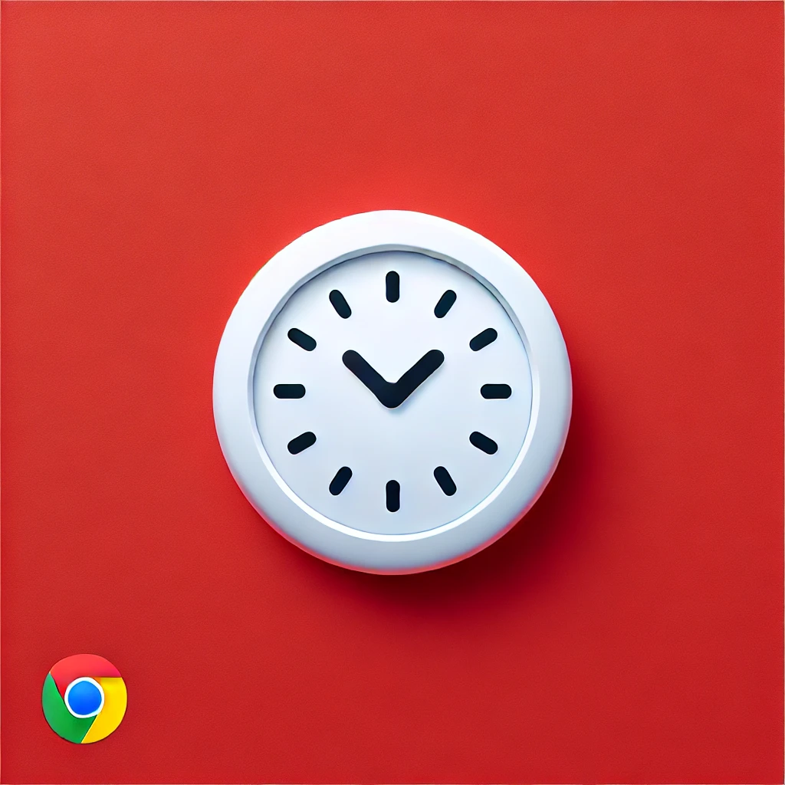

# YouTube Fullscreen Clock



## Overview
The **YouTube Fullscreen Clock** is a browser extension designed to enhance your viewing experience on YouTube by displaying a customizable clock overlay during fullscreen playback. Whether you're watching tutorials, live streams, or your favorite videos, this extension ensures you always know the time without leaving the fullscreen mode.

## Features
- **Customizable Clock**: Adjust the clock's position, color, and size to fit your preferences.
- **Seamless Integration**: Automatically activates when you enter fullscreen mode on YouTube.
- **Lightweight**: Minimal impact on performance and resource usage.
- **User-Friendly Interface**: Easy-to-use popup for settings adjustments.

## Installation
### For Chrome
1. Clone the repository:
   ```bash
   git clone <repository-url>
   ```
2. Navigate to the project directory:
   ```bash
   cd Youtube-Fullscreen-Clock
   ```
3. Open Chrome and go to `chrome://extensions/`.
4. Enable "Developer mode" in the top right corner.
5. Click "Load unpacked" and select the project directory.

### For Firefox
1. Clone the repository:
   ```bash
   git clone <repository-url>
   ```
2. Navigate to the project directory:
   ```bash
   cd Youtube-Fullscreen-Clock
   ```
3. Open Firefox and go to `about:debugging#/runtime/this-firefox`.
4. Click "Load Temporary Add-on" and select the `manifest.json` file.

## Usage
- Once installed, the clock will automatically appear when you enter fullscreen mode on YouTube.
- Access the extension's settings by clicking the extension icon in the toolbar to customize the clock display.

## Permissions
This extension requires the following permissions:
- **storage**: To save user settings and preferences.
- **activeTab**: To interact with the current tab and display the clock.
- **https://*.carbonads.com/**: For displaying ads (if applicable).

## Contributing
We welcome contributions! If you have suggestions for improvements or find bugs, please open an issue or submit a pull request. 

### Guidelines for Contributions
- Ensure your code adheres to the project's coding standards.
- Write clear commit messages.
- Include tests for new features or bug fixes.

## License
This project is licensed under the MIT License. See the [LICENSE](LICENSE) file for details.

## Acknowledgments
- Inspired by the need for a better viewing experience on YouTube.
- Special thanks to the open-source community for their invaluable resources and support.

## Contact
For any inquiries or support, please reach out to [your-email@example.com](mailto:your-email@example.com).

---

**Enjoy your enhanced YouTube experience with the YouTube Fullscreen Clock!**